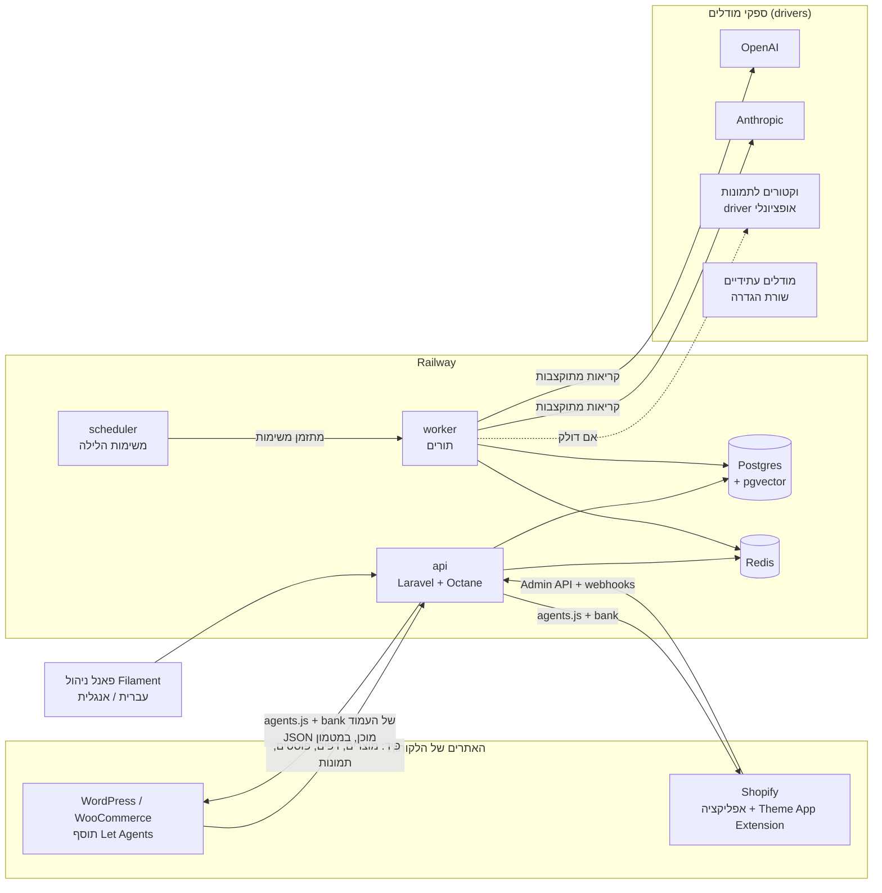
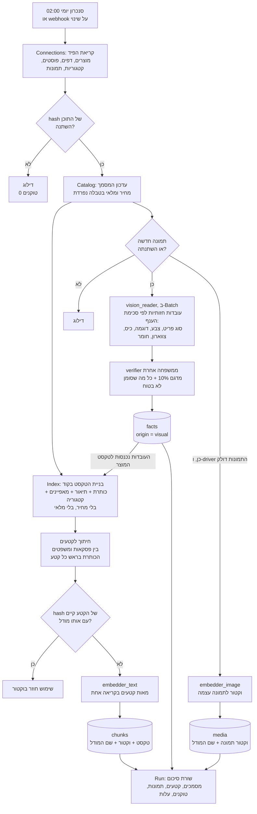
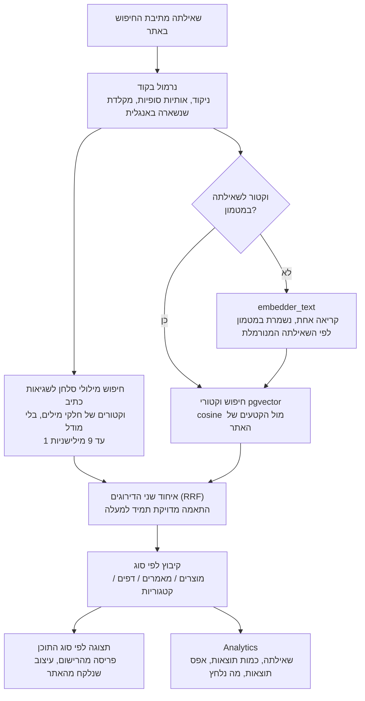
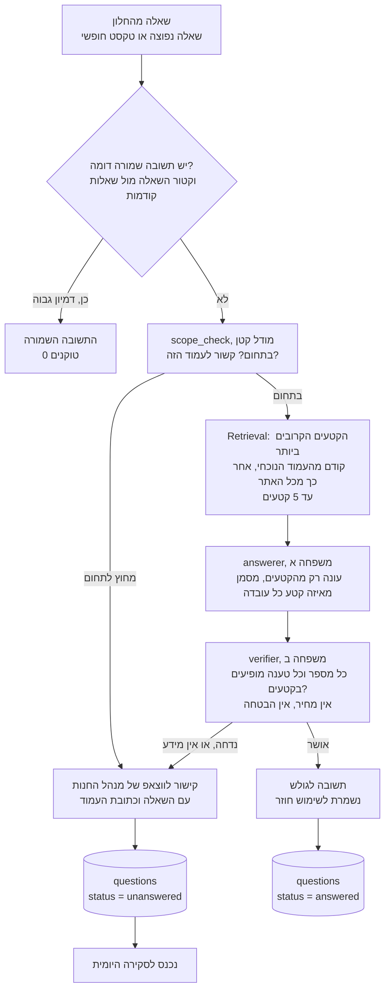
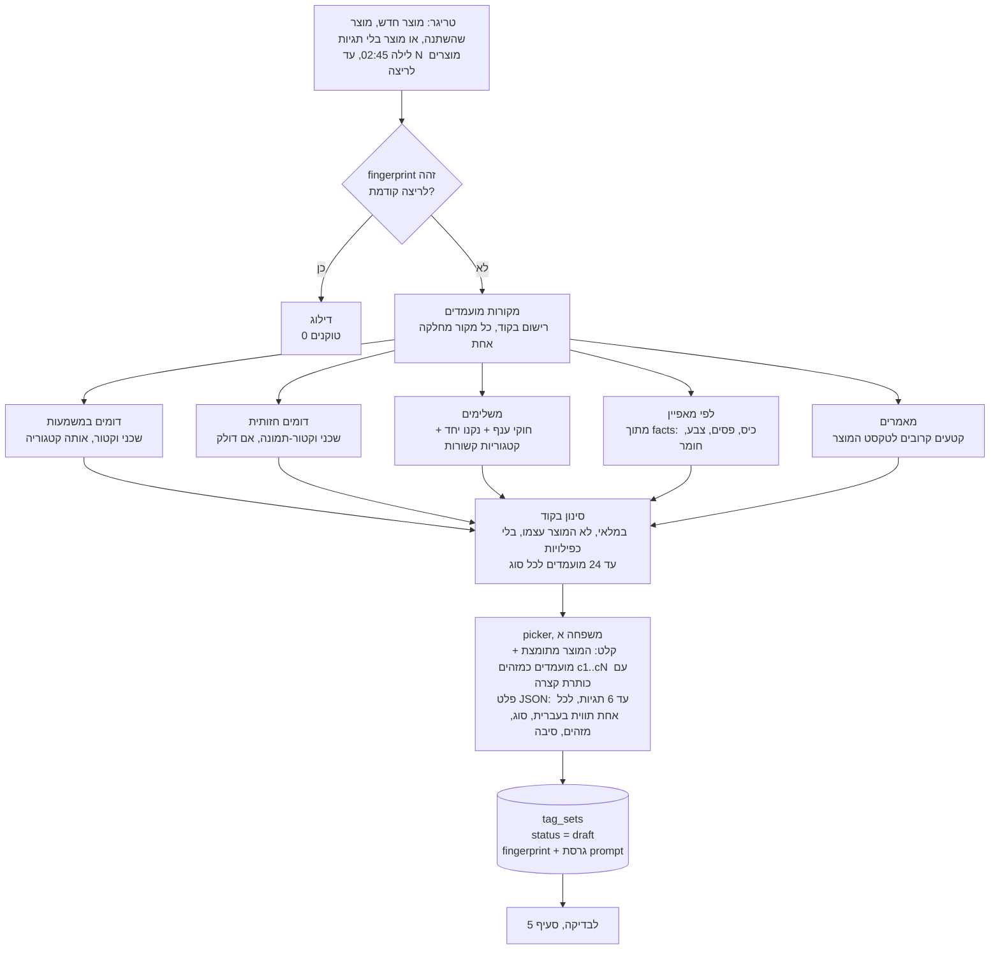
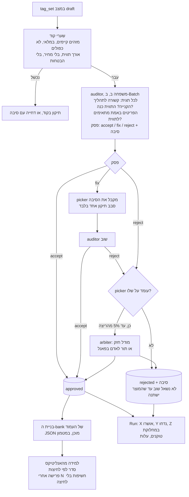
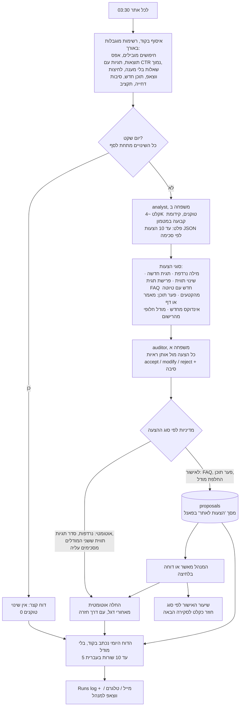
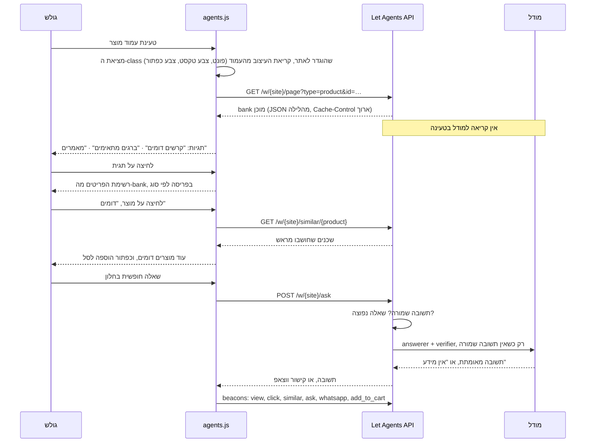
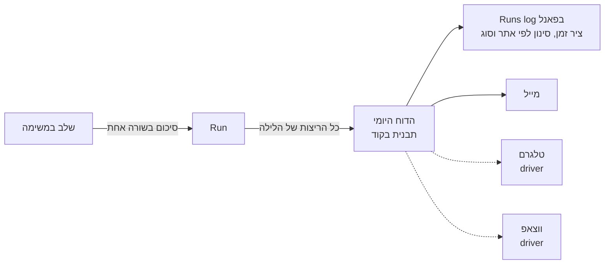

# תרשימי זרימה — Let Agents

> **עדכון:** 2026-10-06. **סטטוס:** הצעה לאישור, לפני שורת קוד ראשונה.
> **מה זה המסמך:** חמשת התהליכים שביקשת לראות לפני הבנייה — יצירת הוקטורים, ה‑RAG בזמן אמת, יצירת ההתאמות,
> בדיקת ההתאמות במודל ממשפחה אחרת, והמודול היומי שמשפר את המערכת — ועוד שלושה שמחברים אותם: מבט‑על,
> מה קורה בדפדפן, ואיך הכול נרשם ללוג. הפירוט של המודולים, הטבלאות וה‑API נמצא ב‑[02-system-design.md](02-system-design.md);
> המודלים, התפקידים והתקציב ב‑[03-models-and-budget.md](03-models-and-budget.md).
>
> התרשימים כתובים ב‑Mermaid. GitHub מציג אותם, וגם VS Code עם תוסף Mermaid.
> **גרסה מרונדרת, עם הסקיצה החיה של הרכיב:** https://claude.ai/artifact/U9Nyj1Cfii6HDPAHnWwPsB (פרטי, לבעל החשבון).

---

## תוכן

0. [עקרונות שכל התרשימים מקיימים](#0-עקרונות)
1. [מבט‑על](#1-מבט-על)
2. [יצירת הוקטורים](#2-יצירת-הוקטורים)
3. [RAG בזמן אמת: חיפוש ושאלות](#3-rag-בזמן-אמת)
4. [יצירת התאמות](#4-יצירת-התאמות)
5. [בדיקת ההתאמות במודל שני](#5-בדיקת-ההתאמות)
6. [המודול היומי](#6-המודול-היומי)
7. [מה קורה בדפדפן](#7-מה-קורה-בדפדפן)
8. [הלוג והסיכומים](#8-הלוג-והסיכומים)
9. [לוח הזמנים בלילה](#9-לוח-הזמנים)
10. [שאלות פתוחות אליך](#10-שאלות-פתוחות)

---

## 0. עקרונות

| # | עיקרון | מה זה אומר בפועל |
|---|---|---|
| 1 | **אין מודל בטעינת עמוד ואין מודל בהקלדה** | החיפוש והתגיות מוגשים מ‑JSON שנבנה מראש ומוקטור שכבר קיים. מודל רץ רק ברקע (בלילה) או כשגולש שולח שאלה. |
| 2 | **קוד לפני מודל** | ספירות, סינון, מועמדים, חיפוש מילולי, מטמון, בדיקת ציטוטים: בקוד. המודל מקבל קלט מתומצת עם מזהים ועונה ב‑JSON לפי סכימה. |
| 3 | **שתי משפחות** | מה שמודל ממשפחה אחת (OpenAI) מייצר, מודל ממשפחה אחרת (Claude) בודק, ולהפך. הקוד אוכף שהכותב והבודק אינם מאותה משפחה. |
| 4 | **לא שואלים פעמיים** | לכל בקשה למודל יש טביעת אצבע (fingerprint) של הקלט. קלט שלא השתנה לא נשלח שוב. |
| 5 | **כל קריאה נרשמת** | לפני: בדיקת תקציב (SpendGuard). אחרי: טוקנים, מטמון, batch, עלות, משך, ושורת סיכום בעברית ב‑Run. |
| 6 | **הכול רישום** | פלטפורמות, מקורות מסמכים, מקורות מועמדים, מודלים, פריסות תצוגה, סוגי הצעות: כולם drivers שנרשמים בשורה אחת. מודל חדש הוא שורת הגדרה, לא קוד. |
| 7 | **כל אתר מבודד** | כל טבלה שייכת לאתר. שאילתה בלי אתר בהקשר נזרקת. |

---

## 1. מבט‑על



- האתרים שולחים תוכן ומקבלים בחזרה סקריפט אחד (`agents.js`) ו‑JSON מוכן לכל עמוד.
- כל העבודה עם מודלים קורית ב‑worker, ברקע, דרך drivers. בטעינת עמוד אין שום קריאה החוצה.
- פאנל אחד לשתי הפלטפורמות. אותם מסכים, אותם נתונים.

---

## 2. יצירת הוקטורים



**מה נכנס לטקסט שהופך לוקטור, ומה לא**

| נכנס | לא נכנס | למה |
|---|---|---|
| כותרת, תיאור, מאפיינים, קטגוריה, תגיות, מק"ט | מחיר, מלאי, מבצע | משתנים כל יום והיו מזיזים את הוקטור בלי שהמשמעות השתנתה |
| עובדות חזותיות שאושרו ("חולצת טי, אפור, כיס על החזה, פסים") | תיאור חופשי של המודל על התמונה | עובדות לפי סכימה ניתנות לסינון ("כל החולצות עם כיס"); פרוזה לא |
| טקסט המאמר, מחולק לקטעים עם הכותרת | תגובות, תפריטים, footer | רעש שמושך תוצאות לא קשורות |

**שני סוגי וקטורים לתמונה, ולמה שניהם**

- **עובדות חזותיות** (ברירת מחדל, דולק): מודל ראייה ממלא סכימה קבועה לכל ענף. התוצאה היא גם טקסט שנכנס לוקטור של המוצר וגם מסננים לתגיות ("חולצות פסים", "עם כיס"). עובד עם המפתחות שכבר יש (OpenAI / Anthropic).
- **וקטור לתמונה עצמה** (driver, כבוי כברירת מחדל): מודל embeddings רב‑אופני. נותן "נראה דומה" גם כשאין מילים לזה (גזרה, סטייל, גוון). נדלק לאתרי אופנה ועיצוב. ההחלטה המלאה ב‑[ADR 0003](ADR/0003-images-visual-facts-then-vectors.md).

---

## 3. RAG בזמן אמת

### 3א. חיפוש: בלי מודל שפה



- שתי רגליים: **מילולית** (מוצאת "מקיטא" כשהתכוונו למקיטה, בלי שום עלות; האלגוריתם כבר נבנה ונבדק בחנות גואטה) ו**וקטורית** (מוצאת "משהו לחבר קרשים" כשהתכוונו לברגים).
- העלות היחידה היא וקטור אחד לשאילתה חדשה. שאילתה שכבר נראתה לא עולה כלום.
- רשימת "אפס תוצאות" היא קלט מרכזי למודול היומי (סעיף 6).

### 3ב. שאלה בחלון: מודל רק כשאין תשובה שמורה



- "תסכם לי את המאמר" היא שאלה רגילה: הקטעים הם המאמר כולו, והתשובה חייבת להישען עליהם.
- שאלה שחוזרת מקבלת את התשובה השמורה מהפעם הראשונה. ככל שעובר זמן, יותר שאלות עולות אפס.
- כל שאלה בלי תשובה היא הזדמנות: היא נכנסת לרשימת "מה חסר באתר" של המודול היומי.

---

## 4. יצירת התאמות

ההתאמות הן התגיות שהגולש רואה בעמוד: "קרשים דומים", "ברגים מתאימים", "מקדחות לעבודה הזאת", "מאמרים". לכל תגית יש רשימת פריטים.



- **הקוד מוצא, המודל בוחר.** המודל לא ממציא מוצרים: הוא מקבל מזהים ומחזיר מזהים. מוצר שלא הוצע לא יכול להופיע.
- **התוויות בעברית נכתבות על ידי המודל** כי זה טקסט שגולש רואה. לפי [ADR 0002](ADR/0002-two-model-families.md) זה OpenAI, והבודק הוא Claude.
- **טביעת האצבע** כוללת את טקסט המוצר, את רשימת המועמדים ואת הראיות שלהם ברמות גסות. הזמנה חדשה אחת לא גורמת לשאול מחדש על כל החנות.
- בלי היסטוריית הזמנות (אתר חדש) "משלימים" נשען על חוקי ענף ועל קטגוריות קשורות. ברגע שיש הזמנות, "נקנו יחד" מתווסף מעצמו.

---

## 5. בדיקת ההתאמות



- **הבודק רואה את המוצרים האמיתיים**, לא רק מזהים: כותרת, קטגוריה, מאפיינים. אחרת הוא לא יכול לשפוט.
- **הבודק הוא ממשפחה אחרת מהבוחר.** שתי משפחות טועות אחרת, ולכן שגיאה שתעבור את שתיהן נדירה.
- **סבב תיקון אחד.** אחריו: אישור, דחייה, או (במכסה קטנה) בורר. בלי לולאות.
- **גם דחייה נשמרת** עם הסיבה. המודול היומי קורא את הסיבות ולומד מהן (למשל: "הרבה דחיות כי אזל מהמלאי" → לסנן מלאי קודם).

---

## 6. המודול היומי



- **הקלט למודל קבוע בגודלו**: 30 חיפושים, 20 אפס‑תוצאות, 10 שאלות, 10 תגיות חלשות. אתר גדול ואתר קטן עולים אותו דבר.
- **יום שקט לא עולה כלום.** אם אין אפס‑תוצאות חדשים, אין שאלות בלי מענה ואין תוכן חדש, אין קריאה.
- **ההצעות מוגבלות ל‑10** ומסודרות לפי ראיות. כל הצעה מצביעה על הראיה שלה (אילו חיפושים, אילו שאלות).
- **הדוח עצמו לא נכתב על ידי מודל.** הוא תבנית שממלאת מספרים. ככה הוא תמיד מדויק ותמיד בחינם.
- **מודלים עתידיים:** רישום המודלים מתעדכן שבועית מרשימות הספקים. מודל חדש מופיע כהצעה ("יש Haiku חדש, זול ב‑40% לתפקיד auditor"). ההחלפה היא שלך, אחרי ריצה על סט הזהב של האתר.

---

## 7. מה קורה בדפדפן



- **הטעינה חיצונית:** תג סקריפט אחד. הסקריפט מחפש את ה‑class שהוגדר לאתר בפאנל (למשל `.product-summary` או `.entry-content`), ורק אם מצא, מצייר.
- **העיצוב נלקח מהאתר:** פונט, צבע טקסט, צבע הכפתור הראשי, רדיוס. אפשר לדרוס בפאנל. הפריסות (רשת מוצרים עם תמונות, רשימת מאמרים, דפים) הן רישום, לפי סוג התוכן.
- **הסקריפט לא יודע כלום על מודלים.** הוא מציג JSON ושולח אירועים.

---

## 8. הלוג והסיכומים

כל משימה היא **Run**: אתר, סוג, מתי התחילה, כמה נמשכה, סטטוס, טוקנים, עלות, ורשימת שלבים. לכל שלב שורת סיכום אחת בעברית. המפתחות והטוקנים של הספקים מוסתרים לפני השמירה.



דוגמה לדוח יומי, כפי שהוא ייראה:

```
Let Agents · סיכום יומי · גואטה אביגדור · 6.10.2026

סנכרון    1,204 מוצרים, 38 מאמרים. 12 מוצרים חדשים, 3 הוסרו מהאתר.
אינדקס    41 קטעים חדשים, 9 תמונות נותחו.
התאמות    12 מוצרים נבדקו. 31 תגיות אושרו, 4 נדחו (2 אזלו מהמלאי, 2 לא קשורות), 1 ממתינה להחלטתך.
חיפוש     318 חיפושים, 9 בלי תוצאות. הבולט: "קרש דק" ×6. הוחלה מילה נרדפת: דק ≈ מרפסת עץ.
שאלות     14 נשאלו, 11 נענו מהאתר, 3 הופנו לווצאפ. חוזרת: "מה זמן האספקה לאילת?" ×3.
הצעות     2 חדשות ממתינות לאישור: מאמר "איך בוחרים ברגים לדק", FAQ זמני אספקה.
תקציב     0.41 $ היום, 4.10 $ מתוך 6 $ החודש.
```

---

## 9. לוח הזמנים

שעון ישראל, לכל אתר בנפרד. הסדר חשוב: כל שלב נשען על הקודם.

| שעה | משימה | מודל? | מה קורה אם נכשל |
|---|---|---|---|
| 02:00 | סנכרון תוכן מהאתר | לא | הלילה ממשיך על הנתונים של אתמול, הדוח מציין |
| 02:20 | אינדקס: קטעים ותמונות שהשתנו | embedder, vision_reader (Batch) | מוצרים שלא קיבלו וקטור נכנסים לתור של מחר |
| 02:45 | יצירת התאמות | picker | מוצרים שלא נשאלו נשארים עם התגיות הקודמות |
| 03:00 | בדיקת ההתאמות | auditor (Batch), arbiter נדיר | טיוטות נשארות draft ולא מתפרסמות |
| 03:20 | ציוני אנליטיקס: לחיצות, חשיפות, פרישות | לא | הסדר של אתמול נשאר |
| 03:30 | סקירה יומית והצעות | analyst, auditor | "לא רצה" בדוח, ניסיון שוב בשעה 06:00 |
| 03:45 | בניית ה‑bank לכל העמודים ופרסום למטמון | לא | ה‑bank הקודם ממשיך להיות מוגש |
| 03:50 | הדוח היומי | לא | נשלח גם כשחלק מהשלבים נכשלו, עם הסיבה |
| כל שעה | עיבוד שאלות שהצטברו, רענון תשובות ישנות | answerer, verifier | השאלה נשארת בתור |
| שבועי | רענון רישום המודלים מהספקים | לא | הרישום הקודם נשאר |

---

## 10. שאלות פתוחות

החלטות שאני צריך ממך לפני הבנייה, עם ההמלצה שלי:

| # | שאלה | ההמלצה |
|---|---|---|
| 1 | **לבנות על הקרנל של Rega או מאפס?** Core, Tenancy, Runs, Ai ו‑Admin של Rega הם בדיוק מה שצריך כאן, והם כבר רצים בפרודקשן. | להעתיק את ארבעת המודולים האלה כנקודת פתיחה, בריפו חדש ונפרד. [ADR 0001](ADR/0001-new-product-on-the-rega-kernel.md) |
| 2 | **Shopify: אפליקציה פרטית (custom app) לכל חנות, או אפליקציה ציבורית?** פרטית עובדת מיד; ציבורית דורשת Partner app, OAuth ובדיקת Shopify. | להתחיל בפרטית לחנויות שלך, לבנות את הקוד כך שהמעבר לציבורית הוא OAuth בלבד. |
| 3 | **וקטורים לתמונות:** איזה ספק? (Voyage, Cohere, Jina). כבוי כברירת מחדל, נדלק לאופנה. | לבחור כשיהיה אתר אופנה ראשון. העובדות החזותיות מספיקות להתחלה. |
| 4 | **ערוץ הדוח היומי:** מייל, טלגרם, ווצאפ? | מייל קודם (קיים ב‑Laravel). טלגרם זול וקל. ווצאפ דורש ספק. |
| 5 | **מה מוחל אוטומטית:** האם מילות נרדפות וסדר תגיות יכולים להשתנות בלי אישור? | כן, מאחורי דגל לכל אתר, עם דרך חזרה. כל השאר לאישור. |
| 6 | **תקרת תקציב חודשית לאתר:** | 6 $ כמו ב‑Rega, לשינוי בפאנל. הערכת עלויות ב‑[03-models-and-budget.md](03-models-and-budget.md). |
