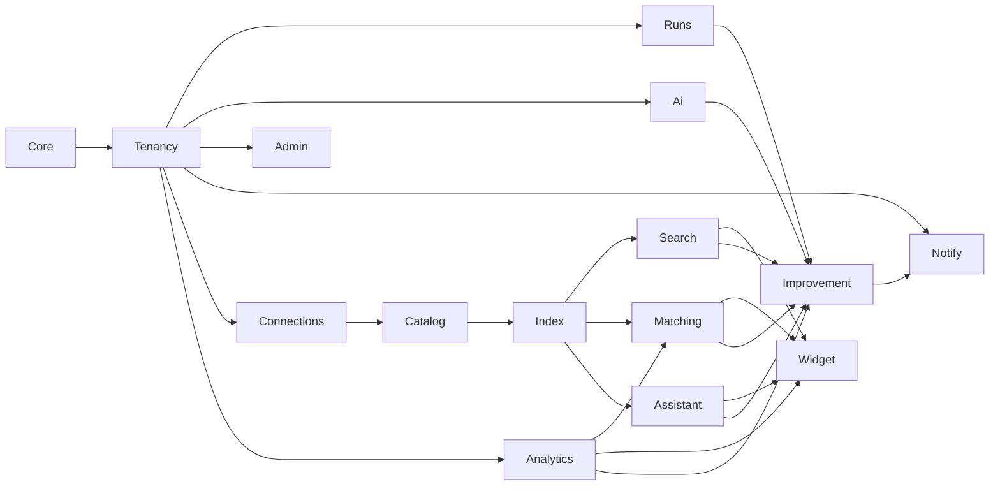

# עיצוב המערכת — Let Agents

> **עדכון:** 2026-10-06. **סטטוס:** הצעה. התרשימים ב‑[01-flows.md](01-flows.md), המודלים והתקציב ב‑[03-models-and-budget.md](03-models-and-budget.md).
> **מה זה המסמך:** המודולים, הטבלאות, ה‑API, התוספים לשתי הפלטפורמות, הרכיב בעמוד, האנליטיקס, הפאנל והאבטחה. מספיק כדי להתחיל לבנות, לא יותר.

---

## 1. מה המערכת עושה, במשפט לכל חלק

| חלק | מה הוא נותן לאתר |
|---|---|
| **אינדקס** | כל מוצר, דף ומאמר באתר, חתוך לקטעים עם וקטור משמעות. תמונות מנותחות לעובדות. |
| **חיפוש** | תיבת חיפוש שמבינה שגיאות כתיב וגם כוונה ("משהו לחבר קרשים"). תוצאות מקובצות לפי סוג. |
| **תגיות בעמוד** | רכיב שנטען לפי class, מציע "תרצו לראות גם": דומים, משלימים, לפי מאפיין, מאמרים. כל פריט פותח עוד דומים. |
| **שאלות** | שאלות נפוצות וטקסט חופשי. תשובה מתוך התוכן של האתר בלבד. כשאין: ווצאפ למנהל. |
| **למידה** | כל חשיפה, לחיצה ושאלה נרשמת. בלילה: סדר חדש, פרישות, והצעות מה להוסיף לאתר. |
| **פאנל** | אתר אחד או כולם. מה נבנה, מה הוצע, מה ממתין לאישור, מה זה עלה. |

---

## 2. מבנה הריפו

```
let-agents/
  apps/api/                 Laravel 13, Filament 5, Octane (FrankenPHP), PHPUnit 12, Pint
    app/Core/               הקרנל: רישום מודולים, דגלים והגדרות, tenancy, i18n. לא מכיר מודולים.
    app/Modules/{Name}/     כל יכולת היא מודול עם module.json (requires, features, settings)
    docker/                 entrypoint לשלושת התפקידים ב‑Railway
    Dockerfile
  packages/event-spec/      JSON Schema של אירועי האנליטיקס, משותף ל‑API, לרכיב ולתוספים
  plugins/wordpress/        תוסף WordPress / WooCommerce (PHP נקי, בלי Composer בזמן ריצה)
  extensions/shopify/       אפליקציית Shopify: Theme App Extension + app proxy
  docs/                     המסמכים האלה, ADR, runbooks
```

הכללים של הקרנל והמודולים זהים לאלה של Rega ([ADR 0001](ADR/0001-new-product-on-the-rega-kernel.md)): מודול מייבא ממודול אחר רק אם הצהיר עליו ב‑`requires`, ורק מ‑`Contracts`, `Models`, `Enums` או `Events`. בדיקת ארכיטקטורה אוכפת.

---

## 3. המודולים



| מודול | אחריות | requires | מה הוא רושם (registries) |
|---|---|---|---|
| **Core** | קרנל: מודולים, דגלים, הגדרות עם גבולות, tenancy, i18n, facades | — | — |
| **Tenancy** | אתרים (site = חנות Shopify אחת או אתר WordPress אחד), משתמשים, תפקידים | Core | — |
| **Runs** | לוג הסוכנים: ריצות, שלבים, סיכום בשורה, טוקנים, עלות. מסתיר סודות | Tenancy | — |
| **Ai** | drivers לספקים, כריכת תפקיד → ספק → מודל, SpendGuard, ledger, רישום מודלים חי | Tenancy, Runs | `ai.chat_drivers`, `ai.embedding_drivers`, `ai.roles` |
| **Admin** | שני פאנלים של Filament: מפעיל (כל האתרים) וסוחר (אתר אחד). he/en | Tenancy | — |
| **Notify** | ערוצי הודעה למנהל: מייל, טלגרם, ווצאפ (drivers) | Tenancy | `notify.channels` |
| **Connections** | חיבור לאתר: טוקן, בדיקת חיבור, `StoreFeed` לכל פלטפורמה, webhooks | Tenancy, Runs | `connections.platforms` (wordpress, shopify) |
| **Catalog** | מסמכים אחידים משתי הפלטפורמות: מוצרים, דפים, פוסטים, קטגוריות, תמונות. סנכרון שלא מוחק | Connections, Runs | `catalog.document_kinds` |
| **Index** | קטעים, וקטורים, עובדות חזותיות. כל וקטור עם שם המודל שלו | Catalog, Ai, Runs | `index.sources` (מה נכנס לאינדקס), `index.vision_schemas` (סכימה לכל ענף) |
| **Search** | חיפוש היברידי: מילולי סלחן + וקטורי. מטמון וקטורי שאילתות. מילים נרדפות | Index, Analytics | `search.rankers` |
| **Matching** | מועמדים בקוד → picker → auditor → tag_sets מאושרים. fingerprint | Index, Analytics, Ai, Runs | `matching.candidate_sources`, `matching.vertical_rules` |
| **Assistant** | שאלות: תשובות שמורות, FAQ, retrieval, answerer, verifier, ווצאפ | Index, Ai, Runs, Analytics | `assistant.fallbacks` |
| **Analytics** | beacons לפי event-spec, ציונים ליליים, פרישות, holdout | Tenancy | — |
| **Widget** | `agents.js`, ה‑bank לכל עמוד, פריסות, עיצוב שנלקח מהאתר, curation של הצוות | Search, Matching, Assistant, Analytics | `widget.layouts` |
| **Improvement** | הסקירה היומית: איסוף, analyst, auditor, מדיניות החלה, proposals, הדוח | Search, Matching, Assistant, Analytics, Ai, Runs, Notify | `improvement.proposal_kinds`, `improvement.collectors` |

כל מודול: `Database/Migrations`, `lang/{he,en}`, `resources/views`, `routes/api.php` (`/api/v1`), `Tests`, מסכי Filament ב‑`Filament/{Operator|Merchant}`. לוגיקה ב‑`Actions` חד‑תכליתיים.

---

## 4. הטבלאות המרכזיות

כל טבלה עם `site_id`. וקטורים ב‑`vector` של pgvector בלי גודל קבוע (המודל הוא הגדרה). ב‑SQLite (בדיקות) הוקטור נשמר כטקסט ומושווה ב‑PHP.

| טבלה | שדות עיקריים | הערות |
|---|---|---|
| `sites` | platform, domain, handle, token (מוצפן), locale, vertical, settings | vertical: hardware, fashion, home, general. קובע סכימת ראייה וחוקי ענף |
| `documents` | kind (product/page/post/category), external_id, title, url, text_hash, image_hash, payload, published_at, removed_at | סנכרון לא מוחק. `removed_at` אחרי קריאה מלאה בלבד |
| `products` | document_id, sku, price, stock, category_ids, tag_ids, image_ids | מחיר ומלאי כאן, לא בטקסט של הוקטור |
| `media` | document_id, url, hash, visual_facts (JSON), embedding, embedding_model | עובדות חזותיות תמיד; וקטור רק אם ה‑driver דולק |
| `chunks` | document_id, position, text, text_hash, embedding, embedding_model | רק קטע שה‑hash שלו השתנה נשלח שוב |
| `facts` | document_id, kind, key, value, origin (code/visual/model/team), status, evidence | עובדה חזותית: kind=visual, key=pattern, value=striped |
| `synonyms` | from, to, origin (team/proposal), applied_at | נכנס לנרמול של החיפוש |
| `tag_sets` | document_id, status (draft/approved/rejected/retired), fingerprint, prompt_version, picker_model, auditor_model | אחד לכל מסמך לכל גרסה |
| `tags` | tag_set_id, kind (similar/visual/complement/attribute/article), label_he, label_en, refs (JSON), evidence, verdict, reason, position | refs = מזהי מסמכים |
| `questions` | document_id (nullable), text, normalized_hash, embedding, answer, sources (JSON), status (answered/unanswered/team), verifier_verdict, asked_count, prompt_version | שאלה חוזרת מגדילה asked_count |
| `faqs` | scope (site/category/document), scope_id, question, answer, source (team/proposal) | מוצגות כצ'יפים בחלון |
| `search_queries` | query, normalized, results_count, clicked_document_id, embedding (cache) | גם הלוג וגם מטמון הוקטורים |
| `events` | visitor_hash, kind, document_id, payload, occurred_at | לפי event-spec. בלי פרטים מזהים |
| `scores` | subject_type, subject_id, page_document_id, exposures, clicks, score, retired_at | מחושב בלילה |
| `proposals` | run_id, kind, title, body (JSON), evidence (JSON), status (proposed/approved/applied/rejected), proposed_by, audited_by, audit_reason, decided_by, decided_at | מסך "הצעות לאתר" |
| `runs` | kind, status, started_at, finished_at, summary_he, summary_en, tokens_in, tokens_out, tokens_cached, cost_usd, steps (JSON) | הלוג |
| `ai_ledger` | run_id, role, provider, model, tokens_in, tokens_out, tokens_cache_read, tokens_cache_write, batch, cost_usd, duration_ms | כל קריאה |
| `model_registry` | provider, model_id, capabilities, input_usd_per_m, output_usd_per_m, first_seen_at, status (new/active/retired) | מתעדכן שבועית מרשימות הספקים |
| `widget_curation` | page_document_id, subject (tag/item), action (pin/hide), by_user | הצוות גובר על הלמידה |

---

## 5. ה‑API

### 5.1 פנימה: מהאתר אל המערכת (טוקן אתר, חתימה HMAC)

| נתיב | מי קורא | מה |
|---|---|---|
| `POST /api/v1/connect` | התוסף/האפליקציה בהתקנה | אימות טוקן, החזרת site key ציבורי ו‑webhook secret |
| `GET /api/v1/feed/*` (נקרא על ידי ה‑API) | Connections | ב‑WordPress ה‑API מושך מהתוסף: `/wp-json/letagents/v1/{products,posts,pages,media}` עם paging. ב‑Shopify מה‑Admin API |
| `POST /api/v1/webhooks/{platform}` | האתר | מוצר/פוסט נוצר, עודכן, נמחק. מדליק סנכרון חלקי |
| `POST /api/v1/orders/summary` | התוסף, אופציונלי | סיכומי הזמנות בלי פרטי לקוח, ל"נקנו יחד" |

התוסף הוא **קריאה בלבד** כלפי האתר: בלי נתיבי כתיבה, בלי משתמשים, בלי לקוחות. שדות רגישים (עלות, ספק, הערות פנימיות) לא יוצאים מהאתר.

### 5.2 החוצה: מהדפדפן אל המערכת (site key ציבורי, בדיקת origin)

| נתיב | מטמון | מה |
|---|---|---|
| `GET /w/{site}/agents.js` | ארוך, גרסה בנתיב | הסקריפט |
| `GET /w/{site}/page?type=&id=` | ארוך, נבנה בלילה | ה‑bank: תגיות, פריטים, FAQ, עיצוב |
| `GET /w/{site}/similar/{document}` | ארוך | שכנים שחושבו מראש |
| `GET /w/{site}/search?q=` | קצר, לפי שאילתה | תוצאות מקובצות לפי סוג |
| `GET /w/{site}/suggest?q=` | קצר | הצעות בזמן הקלדה, מילולי בלבד |
| `POST /w/{site}/ask` | אין | שאלה. מוגבל לפי אתר ולפי visitor |
| `POST /w/{site}/events` | אין | beacons, מאומתים מול event-spec |

הנתיבים תחת `/w/*` יושבים מאחורי Cloudflare עם cache rules ארוכים. גרסה בנתיב, אין purge.

---

## 6. שתי הפלטפורמות

| | WordPress / WooCommerce | Shopify |
|---|---|---|
| **חיבור** | תוסף. מנהל האתר מדביק טוקן מהפאנל. התוסף חושף REST קריאה בלבד | אפליקציה. שלב א: custom app לחנות עם Admin API token. שלב ב: OAuth ציבורי |
| **פיד** | `letagents/v1/products` (WooCommerce) או `posts` (סוג כלשהו), `pages`, `media` | Admin GraphQL: products, collections, articles, pages, files |
| **עדכונים** | hooks של save_post / woocommerce_update_product → POST ל‑webhook שלנו | webhooks: products/update, articles/update, pages/update |
| **הרכיב** | התוסף מזריק `<script src=".../agents.js">`. ה‑class המוגדר בפאנל | Theme App Extension: app embed block מזריק את הסקריפט. app proxy `/apps/agents/*` לקריאות באותו דומיין |
| **החלפת החיפוש** | שכבת JS על טופס החיפוש של התבנית, עם נפילה לחיפוש של WordPress אם ה‑API לא עונה. אופציונלי: `pre_get_posts` כדי שגם `/?s=` יציג את התוצאות שלנו | אותה שכבת JS על טופס החיפוש ועל predictive search של התבנית. נפילה לחיפוש של Shopify |
| **הוספה לסל** | Store API של WooCommerce | AJAX API של Shopify (`/cart/add.js`) |
| **מה לא** | אין כתיבה לאתר, אין גישה למשתמשים ולהזמנות (מלבד סיכומים אנונימיים אם מופעל) | אותו דבר. סקופים: read_products, read_content, read_files |

מה שמשותף נמצא בקוד אחד: הסקריפט, ה‑bank, ה‑API, הפאנל. ההבדל בין הפלטפורמות נגמר ב‑`StoreFeed` ובתוסף.

---

## 7. הרכיב בעמוד

### 7.1 טעינה ומיקום

1. תג סקריפט אחד, `defer`. אין CSS חיצוני: הסגנון בתוך הסקריפט, בתוך `<style>` אחד עם קידומת `la-`.
2. הסקריפט מחפש את ה‑selector שהוגדר לאתר (למשל `.product-summary`, `.entry-content`, `.summary`). מיקום: `after` / `before` / `inside`. לא מצא: לא מצייר, שולח beacon `placement_missing`.
3. מזהה את סוג העמוד (מוצר / מאמר / דף / קטגוריה / חיפוש) מ‑`data-*` שהתוסף מוסיף, או מ‑meta של הפלטפורמה.
4. מושך את ה‑bank. אין bank (עמוד חדש): מציג רק את תיבת השאלה.

### 7.2 עיצוב שנלקח מהאתר

הסקריפט קורא פעם אחת את הסגנון המחושב של העמוד: `font-family` ו‑`color` של ה‑body, צבע הרקע וצבע הטקסט של הכפתור הראשי (הכפתור "הוסף לסל" אם נמצא, אחרת `button` ראשון), `border-radius` שלו. מהם נגזרים משתני CSS: `--la-font`, `--la-fg`, `--la-accent`, `--la-accent-fg`, `--la-radius`. בפאנל אפשר לדרוס כל אחד, ולראות תצוגה מקדימה. [04-widget-sketch.md](04-widget-sketch.md) מראה איך זה נראה.

### 7.3 פריסות (רישום)

| פריסה | מתי | מה מציגה |
|---|---|---|
| `product-grid` | תגית של מוצרים | תמונה, שם, מחיר, כפתור הוספה לסל, "דומים" |
| `product-row` | מובייל, או פחות מ‑3 פריטים | שורה גלילה אופקית |
| `article-list` | תגית של מאמרים | תמונת שער, כותרת, שורת תקציר, "פתח" |
| `page-list` | דפים (מדיניות, משלוחים) | כותרת ושורה |
| `mixed-search` | תוצאות חיפוש | שלוש קבוצות, כל אחת בפריסה שלה, עם "עוד" |
| `ask` | שאלה | צ'יפים של FAQ, שדה טקסט, תשובה עם מקורות, ווצאפ |

### 7.4 מה הרכיב זוכר

ב‑localStorage בלבד, בדפדפן של הגולש: מזהה visitor אקראי, עמודים שנצפו, תגיות שנפתחו. שום דבר לא עולה לשרת מלבד אירועים אנונימיים.

---

## 8. אנליטיקס ולמידה

### 8.1 אירועים (event-spec)

`search.query`, `search.zero`, `search.click`, `widget.view`, `tag.view`, `tag.click`, `item.click`, `similar.open`, `ask.open`, `ask.question`, `ask.answered`, `ask.unanswered`, `ask.whatsapp`, `cart.add` (source: widget / page), `placement_missing`.

כל אירוע: אתר, visitor hash, עמוד, נושא (תגית/פריט/שאלה), חותמת זמן. בלי IP, בלי user agent מלא.

### 8.2 הציונים (לילה, 03:20)

- לכל (עמוד, תגית) ולכל (עמוד, פריט): חשיפות אמיתיות (IntersectionObserver), לחיצות, הוספות לסל. ציון עם דעיכה (חצי‑חיים 30 יום), מוחלק לכיוון הממוצע של האתר כדי שעמוד עם 5 חשיפות לא יקפוץ.
- **פרישה**: תגית או פריט עם N חשיפות (ברירת מחדל 150) בלי לחיצה אחת פורשים מהעמוד ההוא. נשארים בספרייה עם סיבה. חוזרים אוטומטית לניסוי קטן פעם ברבעון.
- **holdout**: 10% מהמבקרים (לפי hash) לא רואים את הרכיב, כדי שאפשר יהיה למדוד מה הוא תורם.
- **הצוות גובר**: pin תמיד ראשון ולא פורש; hide לא חוזר.

### 8.3 מה מוזן לסקירה היומית

הרשימות המוגבלות שב‑[01-flows.md §6](01-flows.md#6-המודול-היומי). כולן נבנות בשאילתות SQL, לא במודל.

---

## 9. הפאנל

שני פאנלים מאותו קוד: **מפעיל** (`/operator`, כל האתרים, בוחר אתר בסרגל העליון) ו**סוחר** (`/merchant`, האתר שלו בלבד). עברית ואנגלית. מסכי הסוחר כתובים ללקוח קצה: מה השתנה ומה ממתין לו, בלי מילה על מודלים או עלויות. המכניקה והעלויות מופיעות רק במסכי המפעיל.

| מסך | מפעיל | סוחר | מה רואים |
|---|---|---|---|
| בית | ✔ | ✔ | חיפושים, שאלות, לחיצות, הוספות לסל, השבוע מול שבוע שעבר |
| חיבור לאתר | ✔ | ✔ | טוקן, בדיקת חיבור, הורדת התוסף, הגדרת ה‑class |
| האינדקס | ✔ | ✔ | כיסוי: מסמכים, קטעים, תמונות שנותחו, מה חסר. כפתור "סרוק עכשיו" |
| חיפושים | ✔ | ✔ | מובילים, אפס תוצאות, מילים נרדפות (הוספה ידנית) |
| תגיות בעמוד | ✔ | ✔ | לכל עמוד: התגיות, הפריטים, למה כל אחד שם (`why`), pin / hide |
| שאלות | ✔ | ✔ | ללא מענה קודם. כתיבת תשובה של הצוות ופרסום כ‑FAQ |
| הצעות לאתר | ✔ | ✔ | ההצעות מהסקירה היומית, עם הראיות. אישור / דחייה בלחיצה |
| עיצוב הרכיב | ✔ | ✔ | הצבעים שנלקחו מהאתר, דריסה, תצוגה מקדימה חיה |
| הדוחות היומיים | ✔ | ✔ | הארכיון |
| מודלים ותקציב | ✔ | — | מפתחות, כריכת תפקידים, תקרה, הרישום החי, הצעות להחלפה |
| לוג הסוכנים | ✔ | — | כל Run, השלבים, הטוקנים, העלות, חיפוש |
| מפת המערכת | ✔ | — | התרשימים מהמסמך הזה עם מספרים חיים: מתי רץ, כמה נמשך, כמה עלה |

---

## 10. אבטחה ופרטיות

- טוקני אתרים ומפתחות ספקים מוצפנים במנוחה. בלוג מוסתרים.
- התוסף קריאה בלבד. אין נתיב כתיבה לאתר. אין לקוחות, אין משתמשים.
- כל שאילתה לטבלה של אתר עוברת דרך scope של האתר. בדיקה שמוכיחה שסוחר לא רואה אתר אחר.
- הרכיב: בדיקת origin בשרת לפי הדומיינים של האתר. rate limit לשאלות לפי אתר ולפי visitor.
- גולשים: visitor hash בלבד. אין עוגיות של צד שלישי. אין שליחת טקסט של גולש למודל לפני scope_check.
- תקציב: תקרה חודשית לאתר, חלק מוגדר לכל תפקיד, והמערכת עוצרת בעצמה. חריגה היא כישלון של משימה, לא חשבון מפתיע.

---

## 11. בדיקות

- יחידה ו‑feature ב‑SQLite מקומית, Postgres + pgvector ב‑CI. migration שעבר ב‑SQLite בלבד לא נחשב.
- מודלים מזויפים (`FakeChatModel`, `FakeEmbedder`) בכל הבדיקות. בדיקה שמוכיחה שאין קריאה למודל בנתיבי `/w/*` מלבד `/ask`.
- בדיקת ארכיטקטורה: מודול לא מייבא ממודול שלא הצהיר עליו.
- `i18n:check`: כל מחרוזת בשתי השפות.
- התוסף: WordPress Playground עם WooCommerce אמיתי. Shopify: חנות פיתוח.
- סט זהב לכל אתר: תגיות ותשובות שאושרו ידנית. כל החלפת מודל או prompt רצה עליו קודם.
